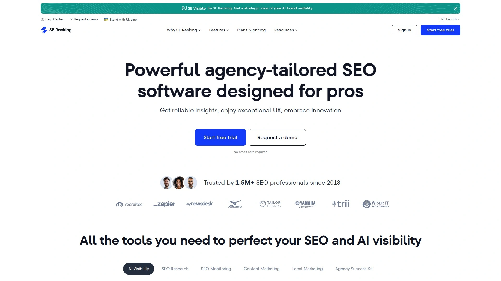

# No More Manual SEO! Recommend 9 AI-Powered Content Optimization Game-Changers

Spending hours researching keywords, manually optimizing every paragraph for search intent, tracking rankings across dozens of pages, then repeating the whole circus next week—traditional SEO work crushes productivity and burns out even experienced marketers. AI-powered SEO platforms automate the repetitive grunt work while delivering data-driven recommendations that actually improve rankings, letting you focus on strategy and creativity instead of spreadsheets and guesswork.

The best AI SEO tools combine keyword research automation, real-time content scoring, rank tracking dashboards, and direct publishing capabilities that compress weeks of manual optimization into hours, delivering measurable traffic increases through platforms handling everything from discovery to deployment.

***

## **[SEO Rocket AI](https://seorocket.ai)**

Complete SEO automation from keyword research through publishing with AI humanization.

SEO Rocket AI delivers end-to-end SEO workflow automation designed specifically for small businesses, freelancers, and agencies wanting to scale organic traffic without hiring entire optimization teams. The platform eliminates the complexity of juggling multiple expensive tools by combining keyword discovery, content creation, rank tracking, and automated publishing into one unified system.

**AI-powered keyword research uncovers opportunities competitors overlook.** The system finds clusters of relevant keywords using AI analysis that's both faster and more comprehensive than manual research, displaying search volume and difficulty levels for every keyword discovered. You can rank results by different criteria including difficulty, search volume, or user intent, helping you prioritize which keywords deliver maximum return for minimum effort.

The content editor produces SEO-optimized articles in minutes rather than hours. Simply input your target keyword and the AI generates content that seamlessly integrates keywords throughout while maintaining natural, engaging writing that readers actually want to consume. The built-in AI humanizer ensures your content sounds authentic rather than robotic—critical since search engines increasingly penalize obviously AI-generated text that lacks genuine value.

Real-time ranking dashboards track your performance across all target keywords with intuitive visualizations and detailed reports. The system sends instant alerts when significant ranking changes occur, letting you stay ahead of algorithm updates or competitor movements. Weekly ranking updates keep you informed without overwhelming you with constant notifications, while actionable insights help you make data-driven decisions that continually improve search engine performance.

Automated publishing capabilities let you plan, schedule, and publish optimized content across WordPress, Webflow, Shopify, and Ghost platforms. Plan your content calendar in advance and the system automatically publishes posts at optimal times for maximum engagement. Bulk sharing functionality handles multiple platforms simultaneously, and the system automatically pulls relevant images from royalty-free stock image websites, eliminating the time sink of manual image sourcing.

Users praise the straightforward interface that makes SEO accessible even without expert knowledge. One reviewer mentioned "What I like most about Seorocket.ai is how easy it is to use, even if you're not an SEO expert. The dashboard is clean, and the suggestions are direct and actionable not full of jargon". The platform particularly suits businesses wanting comprehensive SEO capabilities without the complexity or cost of premium enterprise tools like SEMrush or Ahrefs.

Pricing starts at $39 monthly for AI content generation, humanization features, and ranking trackers, with a free plan available for testing core functionality. The Growth AI plan at $89 monthly accommodates agencies and larger teams managing multiple client projects. The combination of automation, affordability, and beginner-friendly design explains why SEO Rocket AI attracts users who've felt overwhelmed by traditional SEO complexity.

***

## **[Surfer SEO](https://surferseo.com)**

Data-driven content optimization analyzing 500+ on-page ranking signals.

Surfer SEO analyzes over 500 on-page SEO signals from top-performing pages to determine exactly what factors contribute to high rankings. Instead of relying on generic SEO advice, Surfer examines what currently ranks well and provides actionable recommendations to replicate those patterns—including word count, keyword usage, content structure, and formatting choices.

The content editor delivers real-time optimization suggestions as you write, scoring your content against competitors and highlighting gaps you need to address. The system integrates directly with Google Docs and WordPress, letting you optimize within familiar writing environments without switching between multiple platforms. The SERP analyzer breaks down competitor pages across multiple metrics, revealing structural patterns and content approaches that correlate with high rankings.

**Advanced AI features accelerate content production significantly.** Auto-Optimize automatically improves existing content with one click, AI outlines generate comprehensive article structures in seconds, and the content humanizer ensures your writing sounds natural rather than formulaic. Auto internal linking identifies relevant linking opportunities across your site, while content detectors verify your text won't trigger AI-generated content penalties.

The content planner helps develop data-driven strategies for building topical authority in your niche. Instead of randomly creating content hoping it ranks, you identify keyword clusters and content gaps where you can realistically compete. July 2025 updates introduced version history for Auto-Optimize and an API supporting large-scale optimization automation—critical for agencies managing hundreds of client pages.

Pricing starts at $89 monthly with one free credit available for testing, positioning Surfer in the mid-tier range between budget tools and premium platforms. The streamlined optimization process and intuitive interface make Surfer accessible to content teams without deep SEO expertise, though the tool works best when you understand enough SEO to interpret and apply the recommendations strategically.

***

## **[Frase.io](https://frase.io)**

SEO and GEO optimization for ranking on both Google and AI platforms like ChatGPT.

Frase pioneered combined SEO and GEO (Generative Engine Optimization) that optimizes content for traditional search engines while ensuring AI platforms like ChatGPT, Perplexity, Claude, and Gemini cite your content. As AI-powered search experiences grow, getting cited by large language models becomes as important as ranking on Google—and Frase addresses both simultaneously.

The platform analyzes top-performing content across Google's first page and delivers real-time recommendations for both SEO and GEO simultaneously. You see separate optimization scores for Google rankings and AI platform citations, letting you balance your content strategy across both discovery channels. The dual scoring system shows precisely where your content succeeds and where it needs improvement for each audience.

**Context-aware topic analysis understands content like humans do.** Recent October 2025 upgrades rebuilt Frase's topic analysis using advanced AI that reads content contextually rather than just tagging generic keywords. Before the upgrade, you'd see vague topics like "question" or "times"—now you get specific, useful terms like "Conversational AI," "Customer Service," or "Artificial Intelligence" that reflect actual user intent.

The question discovery feature extracts questions users ask about your topic, then suggests comprehensive answers. Answering these questions boosts your chances of getting cited by AI platforms, since LLMs prioritize content providing direct, authoritative answers to user queries. The AI-generated outlines ensure you cover all topics that rank on Google AND get cited by generative AI platforms.

Content optimization happens in real-time with specific suggestions improving both SEO for Google and GEO for AI platforms. See what to add for search rankings and what to fix for AI citations while you write, with recommendations including topic coverage, readability improvements, structure adjustments, and AI-friendly formatting. The platform particularly suits content marketers preparing for the AI-driven future of search rather than just optimizing for today's Google algorithm.

***

## **[Clearscope](https://www.clearscope.io)**

AI-powered content optimization with exceptional keyword discovery and intent matching.

Clearscope uses advanced natural language processing models from IBM Watson to deliver intent-focused keyword data that helps content creators produce highly relevant articles matching what users actually search for. The platform excels at understanding search intent and aligning your content strategy with real user needs rather than just keyword volumes.

Content reports provide the foundation for optimization—enter your target keyword and Clearscope analyzes top-ranking competitors to surface the topics, terms, and questions you must cover to compete. The keyword discovery tools pull data from Google Autocomplete and related searches, identifying semantic topics that improve content relevance. You receive content scores showing exactly how well your writing performs against competitors.

The platform integrates seamlessly with common content creation tools including Google Docs and WordPress, simplifying workflow for content teams. Writers see real-time optimization suggestions without switching between applications, maintaining focus while ensuring SEO requirements get met. The integration approach explains why Clearscope users consistently praise how the tool fits naturally into existing content processes.

**Content inventory management and monitoring features flag SEO issues automatically.** The system identifies technical problems like 404 errors, crawl issues, or indexing problems affecting your rankings. You receive alerts about content decay—when previously high-performing pages start declining—so you can refresh and update before losing significant traffic.

Clearscope pricing ranges from $189 to $399 monthly, positioning it at the premium end compared to budget alternatives. The higher cost gets justified through exceptional data accuracy, intent-matching capabilities, and customer support that actually resolves issues rather than sending template responses. The platform suits established content teams and agencies where accuracy and reliability matter more than rock-bottom pricing.

***

## **[Alli AI](https://www.alliAI.com)**

Technical SEO automation making site-wide optimizations at enterprise scale.

Alli AI specializes in bulk on-page optimizations across entire websites—making thousands to millions of code and content changes in minutes rather than weeks of manual editing. The platform delivers technical SEO capabilities that agencies and enterprise sites desperately need when managing hundreds or thousands of pages requiring consistent optimization.

The SEO AI Agent analyzes your website and provides custom recommendations creating actionable SEO plans tailored to your specific situation. Instead of generic advice applicable to any site, you receive precise instructions addressing your actual technical issues, content gaps, and structural problems. The intelligent analysis considers your current optimization level, competitive landscape, and realistic improvement opportunities.

**Site-wide automation handles repetitive tasks that normally consume countless hours.** The internal linking automation analyzes content relationships across your site and generates strategic link suggestions increasing page views while enhancing on-page optimization. Site speed optimizer improves performance through image and font optimization, script and style minification, and other technical improvements that directly impact rankings and user experience.

Real-time competitor gap analysis identifies where competitors rank for keywords you're missing, revealing opportunities for new content or optimization improvements. The detailed, actionable reporting helps agencies demonstrate value to clients through clear performance metrics and improvement documentation. The platform works with any CMS including WordPress, Shopify, and Wix, providing flexibility for teams managing diverse client portfolios.

Pricing starts at $169 monthly for the Small Biz plan covering one user seat, one domain, and 100 keyword tracking slots, with a 10-day free trial available. The higher entry price reflects Alli AI's focus on agencies and enterprises needing sophisticated automation rather than individual bloggers wanting basic optimization. For teams managing multiple sites or large properties, the time savings and scalability justify the investment.

---

## **[SEMrush](https://www.semrush.com)**

Industry-leading all-in-one platform trusted by 10 million users worldwide.

SEMrush dominates the SEO software market with comprehensive toolkit covering keyword research, rank tracking, site audits, competitor analysis, backlink audits, and on-page optimization—everything you need for large-scale SEO campaigns under one roof. The platform serves over 10 million users globally, validating its reliability and depth across diverse use cases.

Extensive keyword research capabilities draw from constantly updated databases tracking billions of keywords across multiple countries and languages. The rank tracking monitors your positions for target keywords with historical data revealing trends and algorithm impact. Site audit functionality crawls your entire website identifying technical issues, broken links, slow pages, and other problems hurting rankings.

The competitor analysis tools reveal what's working for others in your niche—which keywords they rank for, their backlink sources, their top-performing content, and their paid advertising strategies. This intelligence informs your own strategy by showing proven approaches rather than forcing you to guess what might work. Backlink analysis examines your link profile's health and identifies opportunities for improvement.

**Integration with Google Analytics and Search Console centralizes your data.** Instead of jumping between platforms to understand performance, you access comprehensive reporting showing how SEO efforts translate to traffic, conversions, and business results. The on-page SEO checker provides specific recommendations for improving individual pages, while Content Marketing Toolkit helps plan and optimize content strategies.

Pricing starts at $139.95 monthly with a 7-day free trial, positioning SEMrush at premium tier pricing. The higher cost reflects the platform's comprehensiveness—you're replacing multiple specialized tools with one solution, which often costs less than subscribing to separate services for each SEO function. The steep learning curve requires investment to master, but agencies and enterprises running complex campaigns find the depth justifies the effort.

***

## **[Ahrefs](https://www.ahrefs.com)**

Best-in-class backlink analysis with the largest link index in the industry.

Ahrefs built its reputation on backlink intelligence—the platform maintains the largest and most frequently updated backlink index available, crawling billions of pages daily to track link relationships across the web. This foundational strength makes Ahrefs indispensable for competitive link analysis, identifying link building opportunities, and monitoring backlink profile health.

Beyond backlinks, Ahrefs provides comprehensive SEO toolkit including keyword explorer revealing search volumes, difficulty scores, click metrics, and SERP features for any keyword. The content explorer surfaces top-performing content in any niche, showing what topics resonate with audiences and attract links. Site audit crawls your website identifying technical issues, while rank tracker monitors keyword positions across search engines.

The AI Content Helper, released September 2024, helps write content aligning with real search intent without over-optimizing or sounding robotic. The system focuses on comprehensive topical coverage based on competitor analysis rather than chasing keyword density targets that create awkward, unnatural text. Real-time topic coverage scores show how thoroughly you've addressed subjects compared to top-ranking competitors.

**Advanced features include gap analysis and content improvement recommendations.** Review how competitors cover topics you've missed or treated superficially, then use AI assistance to rephrase, summarize, expand sections, or generate meta descriptions. The structured content approach mirrors how top-ranking articles organize information, increasing your chances of ranking well while maintaining readability.

Pricing starts at $129 monthly with a 7-day trial, and no free plan exists—everyone pays for access. Project slots limit how many sites you can track simultaneously on lower tiers, potentially forcing upgrades as your portfolio grows. Despite the cost, the unmatched link analysis capabilities and clean, intuitive interface make Ahrefs worthwhile for serious SEO professionals prioritizing data accuracy and depth.

***

## **[MarketMuse](https://www.marketmuse.com)**

AI content planning showing exactly what to write and how much for maximum impact.

MarketMuse uses AI-powered content intelligence to analyze your existing content, identify gaps where competitors outrank you, and prescribe exactly what content you need to create for ranking improvements. Instead of guessing which topics deserve attention, you receive data-driven recommendations showing where to focus your content production efforts.

The platform builds comprehensive topic models analyzing how search engines understand subject relationships and topical authority. By comparing your content coverage against competitors and search engine expectations, MarketMuse identifies specific topics, subtopics, and concepts you're missing. The system quantifies how much content you need on each topic to establish authority—eliminating guesswork about whether 1,000 or 3,000 words better serves your goals.

Content briefs generated by MarketMuse provide detailed outlines including recommended topics to cover, questions to answer, related concepts to mention, and target word counts for each section. Writers receive clear direction rather than vague instructions to "write about X topic," accelerating content production while ensuring strategic alignment with SEO requirements.

The optimization score updates in real-time as you write, showing how your content compares to top-ranking competitors. You see exactly which topics you've covered thoroughly, which need more depth, and which you've completely overlooked. This granular feedback helps writers stay on track without waiting for editorial reviews identifying gaps after investing hours in drafts.

MarketMuse particularly suits content operations teams producing high volumes of articles where consistency, quality, and strategic alignment matter more than individual creativity. The platform works best for established sites with significant existing content libraries where identifying optimization opportunities across hundreds of pages manually would take prohibitive time and resources.

***

## **[SE Ranking](https://www.seranking.com)**

Complete SEO platform solving any task and automating processes affordably.

SE Ranking provides end-to-end SEO solution handling keyword research, rank tracking, competitor analysis, website audits, backlink monitoring, and content marketing tools at pricing significantly below premium competitors. The platform delivers professional-grade capabilities without enterprise-level costs, making comprehensive SEO accessible to small businesses and solo practitioners.

The keyword research module discovers profitable keywords with detailed metrics including search volume, difficulty, CPC, and competition levels. Rank tracking monitors positions across multiple search engines and locations with white-label reporting capabilities perfect for agencies presenting results to clients. The competitor research tools reveal organic and paid strategies competitors use, identifying opportunities you're missing.

Website audit functionality crawls your site identifying technical SEO issues, on-page problems, and opportunities for improvement. The audit provides prioritized recommendations focusing effort on issues delivering maximum ranking impact. Backlink checker analyzes your link profile while monitoring competitors' backlink acquisition, helping you identify link building opportunities they've successfully leveraged.

**Marketing plan feature creates comprehensive SEO strategies automatically.** Input your goals and the system generates step-by-step plans covering keyword targeting, content creation, technical improvements, and link building. This structured approach helps less experienced users execute effective SEO without deep expertise or expensive consultants guiding every decision.

SE Ranking tracks visibility in AI Overviews—the featured snippets and direct answers Google displays above traditional results. As AI-enhanced search experiences grow, monitoring your appearance in these prominent positions becomes crucial for maintaining visibility. The platform offers competitive pricing with plans accommodating solo practitioners through enterprise teams, all backed by comprehensive reporting and white-label options for agencies.

***

## FAQ

**How do AI SEO tools actually improve rankings compared to manual optimization?**

AI SEO platforms analyze hundreds of ranking signals across top-performing pages in seconds, identifying patterns humans would miss through manual research. They track real-time algorithm changes, competitor movements, and emerging trends, then provide specific, data-backed recommendations rather than generic advice. The automation eliminates tedious tasks like keyword clustering, content scoring, and technical audits, letting you focus on strategy and execution. Tools like SEO Rocket AI and Surfer SEO reduce optimization time from hours to minutes while delivering measurably better results through consistent, algorithm-aligned improvements.

**Can AI-generated SEO content actually rank without getting penalized by Google?**

Modern AI SEO tools like SEO Rocket AI include humanization features specifically designed to make content sound natural rather than robotic. Google doesn't penalize AI-generated content inherently—they penalize low-quality, obviously machine-written text that provides no genuine value to readers. The key involves using AI for research, outlining, and initial drafts, then editing to add unique insights, examples, and personality that only humans provide. Platforms combining AI efficiency with human editorial oversight produce content that ranks well because it genuinely serves user intent better than manually-created alternatives.

**What's the difference between SEO optimization and GEO optimization for AI platforms?**

SEO optimization targets traditional search engines like Google through keyword targeting, backlink building, and technical improvements that help crawlers index and rank your pages. GEO (Generative Engine Optimization) optimizes content for AI platforms like ChatGPT, Perplexity, and Claude that cite sources when answering user questions. GEO requires clear, authoritative answers to common questions, structured data, and content formatting that LLMs can easily parse and cite. Tools like Frase.io now optimize for both simultaneously, ensuring your content gets discovered through traditional search AND cited by AI assistants that increasingly influence how people find information.

---

## Conclusion

AI-powered SEO automation transforms exhausting manual optimization into streamlined workflows that actually deliver measurable ranking improvements and traffic growth. These nine platforms eliminate the repetitive research, scoring, tracking, and reporting tasks that consume hours daily, letting you focus on strategy and content quality instead of spreadsheet drudgery. [SEO Rocket AI](https://seorocket.ai) particularly stands out for businesses and agencies wanting comprehensive end-to-end automation—from keyword discovery through automated publishing across multiple platforms—wrapped in beginner-friendly interfaces that make professional SEO accessible without requiring deep technical expertise or expensive consultants.
